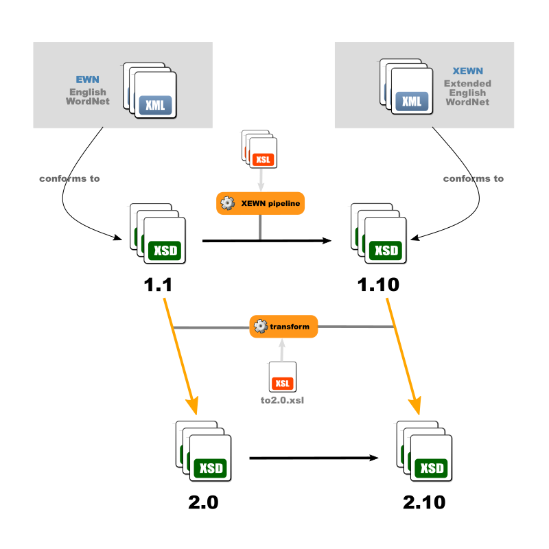

# English WordNet and Extended English Wordnet

[Original README](README_orig.md) 

New:

The different folders (1.0, 2.0, 1.10, ...) correspond to different validation levels that may apply to different sets of data.

Downloadable [here](https://x-englishwordnet.github.io/schemas/) :

https://x-englishwordnet.github.io/schemas/1.1/EWN-LMF-1.1.xsd

https://x-englishwordnet.github.io/schemas/1.1/EWN-LMF-1.1-relax_idrefs.xsd

https://x-englishwordnet.github.io/schemas/1.1/EWN-LMF-1.1b.xsd

https://x-englishwordnet.github.io/schemas/1.1/EWN-LMF-1.1b-relax_idrefs.xsd

https://x-englishwordnet.github.io/schemas/1.10/xEWN-LMF-1.10.xsd

https://x-englishwordnet.github.io/schemas/1.10/xEWN-LMF-1.10-relax_idrefs.xsd

https://x-englishwordnet.github.io/schemas/2.0/EWN-LMF-2.0.xsd

https://x-englishwordnet.github.io/schemas/2.0/EWN-LMF-2.0-relax_idrefs.xsd

